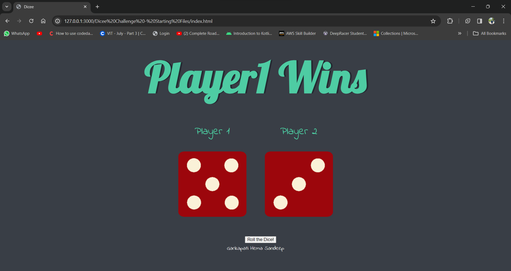

# Dicee Challenge

Welcome to the Dicee Challenge! This simple web application allows two players to roll dice, and the player with the higher dice value wins. If the values are the same, it's a draw!

## Preview


## Getting Started

To run the Dicee Challenge locally, follow these steps:

1. Clone the repository:

```
git clone https://github.com/your-username/dicee-challenge.git
```
1. Open the index.html file in your preferred web browser.
2. Click the "Roll the Dice!" button to initiate the dice roll.

